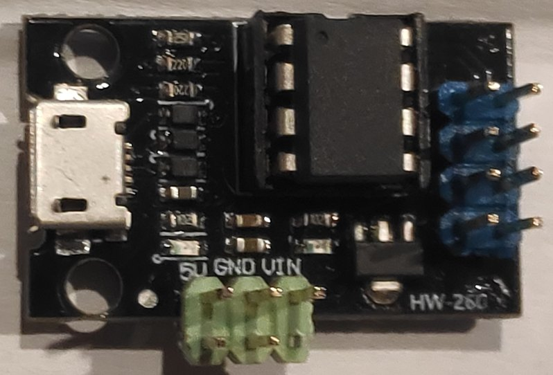

# Summary

This is one of the most inexpensive ways to do electronics with microcontrollers. The board HW-260 accomodates any of 
the chips ATtiny25/45/58. Flashing is performed with USBasp USB ISP programmer which is not shown here.

<table>
<tr>
<th style="text-align:center"> HW-260 board with ATtiny45 Microcontroller</th>
</tr>
<tr>
<td>

</td>
</tr>
</table>

A sample code is provided with ATtiny45 microcontroller which measures temperature and humidity values with DHT22 (PB3, [DHT22-GPL3] code) and activates the output PB1 based on a certain range of values. The code is barely 700 bytes, so ATtiny25 is sufficient for such applications.

# References

- [DHT22-GPL3]
- [DHT22-MIT]

[DHT22-GPL3]: https://github.com/fengcda/DHT_Sensor_AVR_Library
[DHT22-MIT]: https://github.com/efthymios-ks/AVR-DHT
